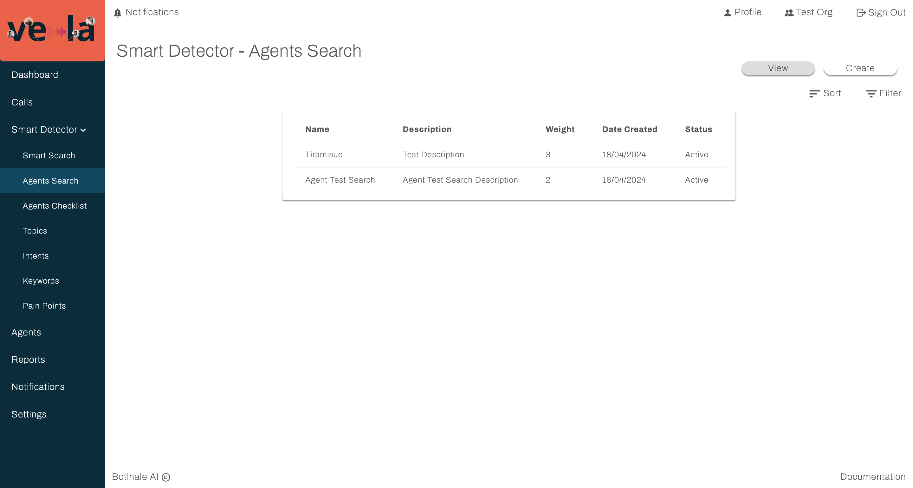
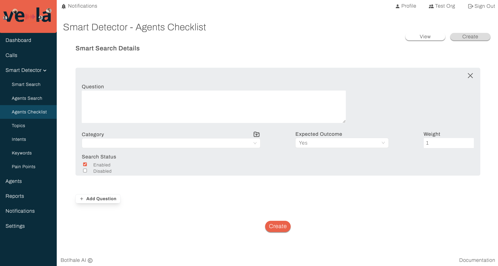

# Smart Detector

The Smart Detector is your central command center for managing automated searches within your call transcripts. It lets you build sophisticated search queries that can find specific elements like keywords, phrases, or topics. These pre-defined criteria work like a constantly running filter on new calls. Once activated, the Smart Detector scans incoming transcripts and automatically flags any matches as "issues" that need further investigation.

The Smart Detector page is organized into three tabs to help you manage different search types:

- **Smart Searches:** This tab allows you to define searches for any purpose, independent of agents.
- **Agents Searches:** This section focuses on searches related to specific agent behaviors identified in calls.
- **Agent Checklists:** Here you can create lists of specific criteria you want agents to follow during calls, with options for assigning points and tracking adherence.

These subsections will explain each type of search in more detail.

## Smart Search

This tab allows users to view and create automated searches applicable to the entire corpus of call transcripts. It also offers offers a library of pre-built search templates for common use cases.

### View

The View tab of Vela's **Smart Detector > Smart Search** screen offers a tabular view of the Smart Search queries created within your organisation.

The View tab facilitates efficient navigation of the created search queries. Users can:

- **Sort:** Order entries by any table column.
- **Filter:** Apply targeted criteria based on various parameters like the query's name, description, date, and status.

:::info
Clicking on a specific search query gives you a view of the specific details of a search as seen in the following image.
:::

### Create

The Create tab of this screen allows you to create new Smart Search queries within your organization.

To create a new Smart Search query:

1. Ensure you are on the Create tab of the Smart Search screen.
2. Enter the requested information outlined and exemplified below.
  - **Name:** Assign a unique name to your Smart Search query (e.g., Competitor Mentions).
  - **Description:** Provide a brief description of your Smart Search query (e.g.One or more competitors are mentioned in the call).
  - **Filters:** Select and define the criteria by which you would like to stratify your search (e.g. words, intents, keywords etc.)
   - **Search Query - Verbatim:** Select this if you want the search to match the exact wording of your query.
   - **Search Query - Non-Verbatim:** Choose this if the search can include transcripts that do not match the wording of your queries exactly.
  - **Search Status:** Set the search status to 'Enabled' to activate the search query or 'Disabled' to deactivate it.
  - **Inference:** Selecting this option applies to search to historical call data. If left unselected, the search will only apply to calls uploaded after it was unabled.
3. Once all information is entered, click on the `Create` button to establish the new Smart Search query.
4. Your newly created Smart Search query appears on the View tab of the Smart Search screen.

### Templates

The Templates tab of this screen allows you to review and enable predefined auto search queries within your organization.

<!-- :::info
Insert image of the template tab once templates have been created
::: -->

:::info
Clicking on the name of a specific template brings you to a detailed view of the predefined auto search query and allows you to enable or disable the query.
:::

The Templates tab facilitates efficient navigation of the predefined search queries. Users can:

- **Sort:** Order entries by any table column.
- **Filter:** Apply targeted criteria based on various parameters like the query's name, description, and status.

### Results

## Agents Search

This tab allows users to create and monitor searches specifically focused on individual agents' performance, identifying trends and areas for improvement based on flagged issues.

### View
Agent-specific searches are presented on the View tab in a tabular format.

The View tab facilitates efficient navigation of the created search queries. Users can:

- **Sort:** Order entries by any table column.
- **Filter:** Apply targeted criteria based on various parameters like the query's name, description, date, and status.

:::info
Clicking on a specific agent search query gives you a view of the specific details of a search as seen in the following image.
:::

### Create

The Create tab of this screen allows you to create new agent search queries within your organization.

To create a new agent search query:

1. Ensure you are on the `Create` tab of the **Smart Detector > Agents Search** screen.
2. Enter the requested information outlined and exemplified below.
  - **Name:** Assign a unique name to your Agents Search query (e.g.,Agent interruptions).
  - **Description:** Provide a brief description of your Agents Search query (e.g., Call segments where the agent interrupts the client).
  - **Weight:** Indicate the relative importance you would like to give this search query (a higher number indicates greater importance).
  - **Filters:** Select the criteria by which you would like to stratify your search (e.g., words)
   - **Search Query - Verbatim:** Select this if you want the search to match the exact wording of your query.
   - **Search Query - Non-Verbatim:** Choose this if the search can include transcripts that do not match the wording of your queries exactly.
  - **Search Status:** Set the search status to 'Enabled' to activate the search query or 'Disabled' to deactivate it.
3. Once all information is entered, click on the `Create` button to establish the new agent search query.
4. Your newly created agent search appears on the View tab of the Agents Search screen.

:::info
The Smart Detector combines the results of this search with that of the Agents Checklist to create an overall score for each agent. This score is then displayed on both the Calls table and the Agents screen, giving you a quick view of each agent's performance.
:::

## Agent Checklist
This tab allows users to create and monitor checklist questions of specific criteria you want agents to follow during calls, with options for assigning points and tracking adherence.

### View

Questions that form part of the Agents Checklist are presented on the View tab in a tabular format.

The View tab facilitates efficient navigation of the created search queries. Users can:

- **Sort:** Order entries by any table column.
- **Filter:** Apply targeted criteria based on various parameters like the query's name, description, date, and status.

Clicking on a specific agent search query gives you a view of the specific details of a search as seen in the following image.

### Create

The Create tab of this screen allows you to add questions to your agent checklist.

To create a new agent search query:

1. Ensure you are on the Create tab of the Smart Detector > Agents Checklist screen.
2. Enter the requested information outlined and exemplified below.
   - **Question:** Describe what the Smart Detector will check for in calls. (e.g., "Did the agent advise the user the call was recorded?")
   - **Category:** Choose a classification for this check (e.g., "Compliance").
   - **Expected Outcome:** Define the desired outcome for agents to earn points. (e.g., "Yes", because agents are expected to inform users that calls are recorded)
   - **Weight:** Assign importance to this check by setting a numeric weight (a higher number indicates more importance)
   - **Search Status:** Activate the check by setting it to "Enabled."
3. Once all information is entered, click on the `Create` button to establish the new Agents Checklist query.
4. Your newly created agent search appears on the View tab of the Agents Checklist screen.

   
:::info
The Smart Detector combines the results of this checklist search with that of the Agents Search to create an overall score for each agent. This score is then displayed on both the Calls table and the Agents screen, giving you a quick view of each agent's performance.
:::

## Topic Search

This tab allows you to create and monitor user-defined topics for grouping calls based on specific themes or categories.

To create a new topic search:

1. Click on the `New Topic` button.
2. In the pop-up window that appears, enter a unique name adequately representing the topic you wish to create.
3. Click `Create Topic`.
4. Your topic is created and displayed on the screen.
5. You can edit or delete existing topic searches using the Edit or Delete icons.

## Intent Search

This tab allows you to create and monitor searches which identify calls associated with particular intents within their dialogue flow.

To create a new intents search:

1. Click on the `New Intent` button.
2. In the pop-up window that appears, enter a unique name adequately representing the intent you wish to create.
3. Click `Create Intent`.
4. Your intent is created and displayed on the screen.
5. You can edit or delete existing intent searches using the Edit or Delete icons.

## Keyword Search

This tab allows you to create and monitor searches which track specific keywords or phrases across the call data.

To create a new keyword search:

1. Click on the `New Keyword` button.
2. In the pop-up window that appears, enter a keyword for the search you wish to create.
3. Click `Create Keyword`.
4. Your keyword search is created and displayed on the screen.
5. You can edit or delete existing keyword searches using the Edit or Delete icons.

## Contact us

:::info
We are here to help! Please [contact us](mailto:support@botlhale.ai) with any questions.
:::
